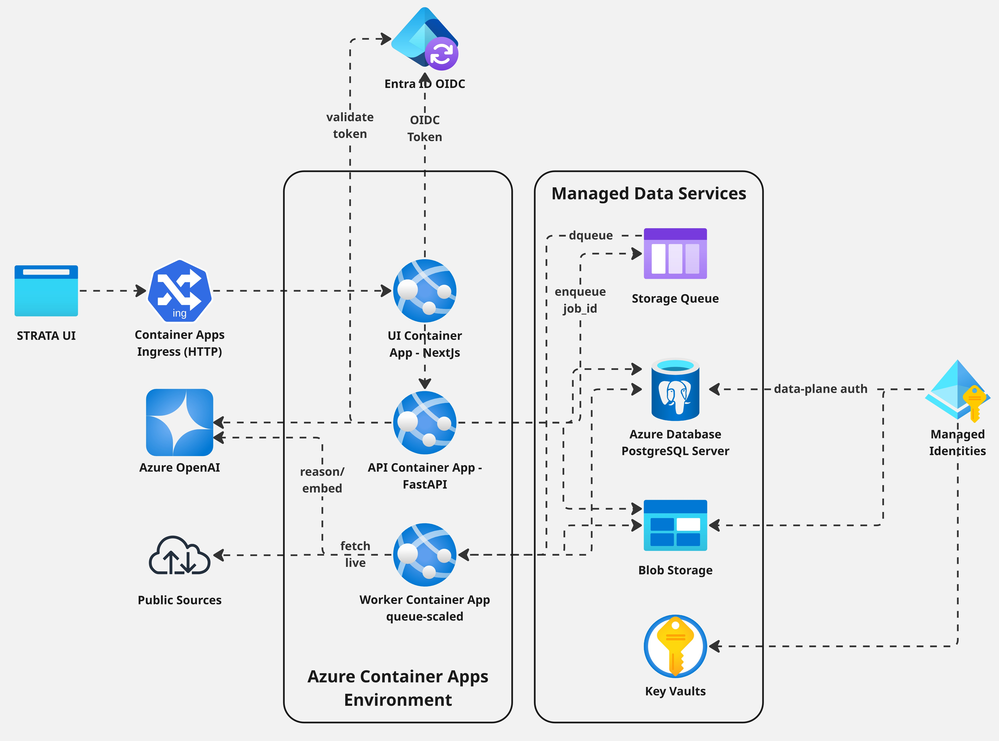
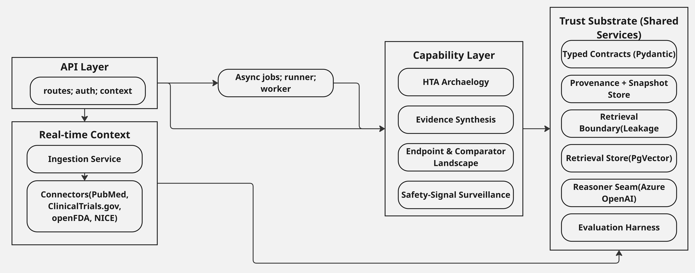
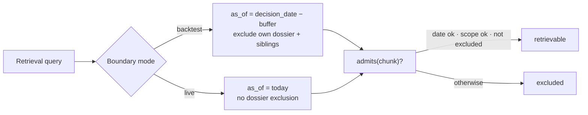
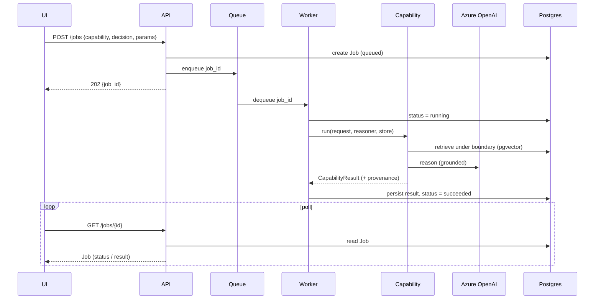
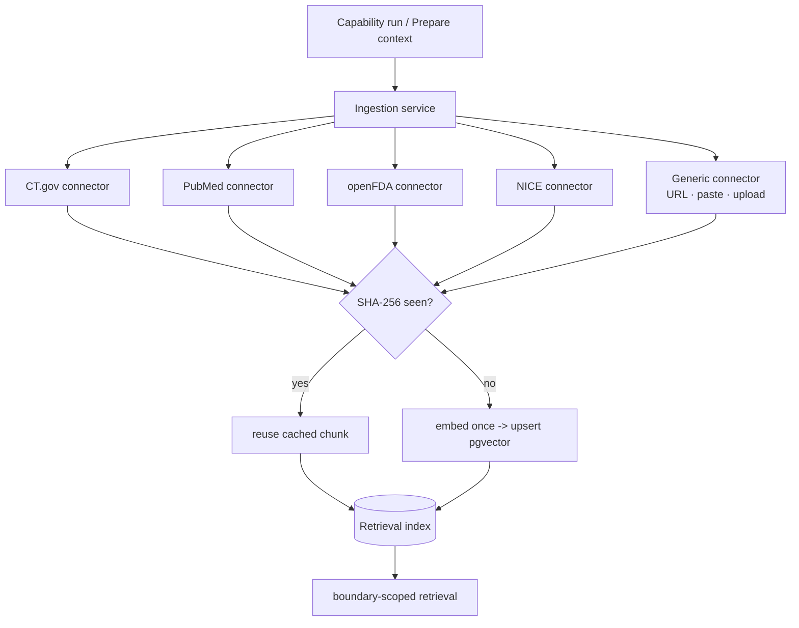
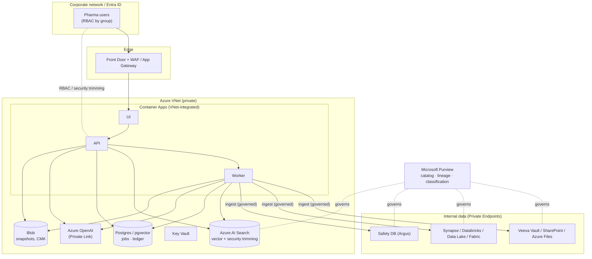
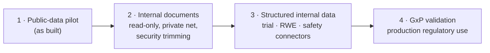

# STRATA - Technical Documentation

**Agentic Integrated Evidence Generation (IEG) for pharma, on a trust substrate.**

Version 1.0 · Azure reference architecture

---

## 1. Introduction & design philosophy

STRATA is a platform for Integrated Evidence Generation: it runs evidence-generation
*capabilities* - anticipating HTA evidence concerns, reconstructing endpoint/comparator
landscapes, synthesising the evidence base, and surveilling safety signals - over a
shared **trust substrate**.

The platform's organising principle is that in a regulated domain the hard problem is
not the AI; it is **whether the AI's output can be trusted, audited, and reproduced**.
Every capability therefore sits on a substrate that guarantees four properties by
construction:

- **Provenance** - every grounded claim traces to the specific source documents it was
  derived from; every ingested document is content-addressed (SHA-256) and immutable.
- **Leakage control** - retrieval is bounded in code so a query cannot see evidence it
  must not (the decision's own dossier, post-cutoff material). A leaky query is
  structurally unrepresentable.
- **Evaluation** - capabilities are measured against a pre-registered, hashed rubric and
  expert-validated gold, not asserted.
- **Determinism & auditability** - orchestration is explicit Python (no agent
  frameworks), data contracts are typed (Pydantic v2), and the system fails loud rather
  than emitting plausible-but-wrong output.

These are the same properties a regulated buyer evaluates, and they are what make STRATA
an *instrument* rather than a chatbot.

---

## 2. System overview

STRATA is a service-oriented system: a stateless API, an asynchronous worker, a Next.js
UI, and a set of backing stores, all deployed as containers on Azure. Capabilities are
invoked as asynchronous jobs; long-running retrieval and reasoning happen out of band
and the client polls for results.

| Layer | Responsibility |
|---|---|
| **UI** (Next.js) | The clinical-instrument interface - capability picker, per-capability consoles, provenance and boundary surfaced visibly. |
| **API** (FastAPI) | Job submission/polling, capability registry, context ingestion, auth. |
| **Worker** | Drains the job queue, executes capabilities over the substrate. |
| **Capabilities** | Thin agents implementing one IEG capability each, interchangeable behind a common interface. |
| **Substrate** | Shared services: contracts, provenance, reasoner, leakage boundary, retrieval store, evaluation. |
| **Stores** | Postgres + pgvector (retrieval, jobs, ledger), Blob (snapshots), Queue (jobs), Key Vault (secrets). |
| **Model** | Azure OpenAI (GPT-5.x) via the reasoner seam. |

---

## 3. Solution architecture (Azure)

Every data-plane access - to Postgres, Blob, the queue, Key Vault, and Azure OpenAI -
is authenticated with a **user-assigned managed identity**, so no secrets live in the
application. The API and worker share one container image; the worker overrides the
entrypoint to run the queue loop and scales on queue depth (to zero when idle).

---

## 4. Component architecture

Adding a capability is a one-line registry change; it touches nothing in the substrate.
This is what lets the platform grow without destabilising its trusted core.

---

## 5. Core concepts (the trust substrate)

### 5.1 Typed contracts
Pydantic v2 models are the only things that cross a layer boundary
(`Decision`, `Chunk`, `SourceRecord`, `Vulnerability`, `Job`, capability results). They
double as validation and, where structured generation is used, as the model's enforced
output schema. Strict mode (`extra="forbid"`) makes a malformed response fail fast.

### 5.2 Provenance & content-addressed snapshots
Every ingested document is hashed (SHA-256) and stored once by that digest - immutable
and attributable, the ALCOA+ property required for regulated data integrity. Every
grounded claim carries the chunk and source ids it was derived from, so any output can
be traced back to its evidence.

### 5.3 The leakage boundary
Retrieval is always parameterised by a `RetrievalBoundary`; there is no unbounded search
method. The boundary composes date cutoff, dossier-disjointness, sibling policy, and
drug scoping as pure predicates. It operates in two modes:

**Backtest** mode is for validation (anchored to a past decision, the experiment that
proved the method). **Live** mode is the product (as-of today, nothing to exclude - a
sponsor anticipating concerns for a drug not yet appraised). The same predicate machinery
serves both; only the cutoff and exclusions differ.

### 5.4 The reasoner seam
Capabilities depend on a `Reasoner` protocol, never a vendor. `AzureOpenAIReasoner`
targets a GPT-5.x deployment: temperature is omitted (reasoning models reject it),
`max_completion_tokens` and `reasoning_effort` are used instead, and auth is via managed
identity (no key in the app). For structured-output capabilities a `StructuredLLM`
variant enforces a Pydantic schema as the response format.

### 5.5 The retrieval store
`pgvector` in the platform's Postgres. The boundary predicates compile to a SQL `WHERE`
clause (date, dossier, siblings, drug) and ranking is vector ANN
(`ORDER BY embedding <=> :q`). An in-memory backend mirrors the behaviour for local and
test runs with no database.

### 5.6 The evaluation harness
A pre-registered rubric, hashed before any scored run, plus per-category precision/recall
and Cohen's κ for inter-annotator agreement. Capabilities are measured through this, never
ad hoc - the discipline that turned the original HTA Archaeology study from an assertion
into a measured finding.

---

## 6. The capability model

Each capability is a thin class over the substrate implementing `run(request, *, reasoner,
store) -> CapabilityResult`. The four:

**HTA Archaeology** *(validated)* - predicts the evidence-concern categories an HTA
committee raised for a decision, closed-book (parametric) vs open-book (grounded). The
validated finding: grounding converts an over-confident prior into a disciplined,
higher-precision predictor, most decisively for cost-effectiveness uncertainty.

**Evidence Synthesis** - produces a structured evidence brief (grounded claims by
dimension) *and* a dossier-style narrative, via two-pass generation: extract grounded
claims, gate them by an automated entailment check, then compose the narrative *only*
from survivors. No fact enters the prose that is not already a grounded, checked claim.

**Endpoint & Comparator Landscape** - for an indication, reconstructs the endpoints and
comparators trials/appraisals used. Structured-first: counts come from the registry
fields deterministically; the model only canonicalises names and flags surrogates
(lexicon-first). Comparators carry the NICE accepted/contested/rejected signal.

**Safety-Signal Surveillance** - disproportionality (PRR/ROR) over FAERS via a guarded
text-to-SQL wrapper over a deterministic signal view, with grounded summary and explicit
"screening, not causal" caveats. Ported from Project VIGIL's validated PV logic.

---

## 7. Asynchronous job orchestration

Locally (no queue configured) the API runs the job in a background task; in Azure the
job_id is enqueued and the worker scales on queue depth.

---

## 8. Real-time external context

Capabilities retrieve from an index that is populated **live** at request time from
external sources, with caching so it is fresh on demand and fast on repeat.

Three caching layers - content-addressed snapshots (same bytes never re-stored),
embed-once (no re-embedding indexed content), and a freshness TTL via a fetch ledger -
keep latency and API load down. The **generic connector** lets a user add a URL, pasted
text, or an uploaded document that becomes a cited, provenance-bearing source on the next
run. Ingestion is an async job with per-connector progress ("fetching ClinicalTrials.gov…").

---

## 9. Data sources & provenance

| Source | Role | Provenance handling |
|---|---|---|
| ClinicalTrials.gov | Trial design, endpoints, comparators | Structured fields preserved; snapshotted by NCT id |
| PubMed | HTA-style reasoning in literature | E-utilities; HEOR soft-boost + molecule fallback |
| openFDA | Labels + FAERS safety | 404-as-zero; query by generic_name; FAERS pre-coded to MedDRA |
| NICE | HTA decisions + committee rationale | Per-TA pages for dates + rationale; the gold |
| Generic / internal | Arbitrary external context | Snapshotted with origin; `DocType.external` |

Every document carries source, doc_type, date, drug/indication tags, content hash, and
fetched-at timestamp - the basis of the audit trail.

---

## 10. API reference

| Method · path | Purpose |
|---|---|
| `GET /health` | Liveness + rubric hash + environment |
| `GET /capabilities` | List registered capabilities |
| `POST /jobs` | Submit a capability job -> `202 {job_id}` |
| `GET /jobs/{id}` | Poll job status / result |
| `POST /context/ingest` | Async live context ingestion -> `{context_job_id}` |
| `GET /context/jobs/{id}` | Per-connector ingestion progress |
| `POST /context/add` | Generic connector (URL / text / file) |
| `GET /context/status` | What is indexed for a drug + freshness |
| `GET /decisions/samples` | Sample decisions (demo) |

Auth is an Entra OIDC bearer dependency, enforced when `AUTH_ENABLED`; tenant is derived
from the token and scopes all data access.

---

## 11. Deployment architecture (Azure / Terraform)

The platform is provisioned by Terraform: a resource group, the user-assigned managed
identity, Log Analytics, Container Registry, Postgres Flexible Server (with the pgvector
extension), a Storage account (Blob container + queue), Key Vault, an Azure OpenAI
account with GPT-5.x and embeddings deployments, the Container Apps environment, and
three Container Apps (API with ingress, queue-scaled worker, UI), with RBAC role
assignments for the identity.

Deployment is two-pass: `terraform apply` stands up the infrastructure; the API/worker
and UI images are built and pushed to the created registry; `terraform apply` runs again
with the image references. A "demo profile" variable (worker `min_replicas=0`, Basic ACR)
trims a short showcase to roughly $5-10; a 3-4 day showcase runs ~$10-20 total, dominated
by always-on compute, with model tokens negligible. The single cost risk is forgetting
`terraform destroy` - left running, the stack is ~$45-70/month.

---

## 12. Security & compliance

**Identity** - Entra ID OIDC for users; a user-assigned managed identity for all
data-plane access, so the application holds no secrets. Secrets that must exist (API keys)
live in Key Vault and are surfaced as references.

**Audit & data integrity** - content-addressed snapshots and append-only run/step records
give an immutable, attributable, reconstructable trail (ALCOA+), supporting 21 CFR Part 11
and EU Annex 11 expectations. The provenance ledger ties every output claim to its sources.

**Leakage & confidentiality control** - retrieval is boundary-gated in code; the same
predicate machinery generalises to access/confidentiality filtering for internal data
(§13).

**Input safety** - the Safety capability's text-to-SQL is constrained by a deny-by-default
`sql_guard` (single read-only SELECT against one whitelisted view). The generic URL
connector is allowlisted with private-IP/metadata blocking to prevent SSRF. Uploads are
type- and size-restricted.

---

## 13. Enterprise adaptation - using internal pharma data (Azure)

The public-data platform is the foundation; a pharma company running IEG in production
will bring its **own internal evidence** - clinical study reports and dossiers, trial
datasets, its safety database, real-world data, prior HTA submissions, and HEOR models.
This section describes how STRATA adapts to that, **Azure-only**, without changing its
trusted core.

### 13.1 The internal evidence landscape

| Internal source | Typical Azure home | How STRATA consumes it |
|---|---|---|
| CSRs, CTD/eCTD dossiers, protocols, SAPs | Veeva Vault / SharePoint / Azure Files | Document connector -> chunk + embed -> index |
| Clinical trial datasets (SDTM/ADaM, EDC) | Azure Data Lake / Synapse / Databricks | Structured connector (query-time or batch) |
| Safety database (Argus / ArisGlobal ICSRs) | Azure SQL / Data Lake (CDC/ETL) | FAERS-pattern connector -> internal disproportionality |
| Real-world data / RWE (claims, EHR, registries) | Data Lake / Fabric | Structured connector, governed access |
| Prior HTA submissions, payer dossiers, HEOR models | Vault / SharePoint / Files | Document connector |
| Regulatory intelligence, label history | SharePoint / internal services | Document / API connector |

The **connector model is the extension point**: each internal source is a new
`ContextConnector` (or a structured fetch) that returns the same snapshotted,
provenance-bearing chunks the public connectors do. Capabilities are unchanged - they
retrieve from one index that now blends public and internal evidence.

### 13.2 Enterprise reference architecture

The shape is the same platform, hardened: **private networking** (VNet-integrated
Container Apps, Private Endpoints/Private Link for every data service and Azure OpenAI, no
public data path), **Azure AI Search** as the enterprise vector store (managed scale,
hybrid semantic search, and document-level **security trimming**), and **Microsoft
Purview** for catalog, lineage, and PHI/PII classification.

### 13.3 The confidentiality boundary (the key adaptation)

STRATA's leakage boundary is already a composition of predicates over retrievable
content. For internal data it generalises naturally into a **confidentiality / access
boundary**: retrieval admits a chunk only if the requesting user's Entra entitlements and
the document's sensitivity classification permit it. Concretely:

- **Security trimming at retrieval** - Azure AI Search filters results by the user's group
  membership (passed from the validated Entra token), so a user only ever retrieves
  documents they are entitled to. The model never sees ungranted content.
- **Deterministic confidentiality rules** - beyond access, classification-driven rules
  (e.g. unblinded data, competitor-confidential, embargoed) are enforced as code
  predicates, the same way temporal leakage is - confidentiality as a filter, not a
  prompt instruction.
- **Provenance distinguishes origin** - each claim is tagged internal vs public; an output
  destined for external sharing can be restricted to public-grounded claims, preventing
  internal evidence from leaking into an external artifact.

This is the same architectural move that made the public platform trustworthy, applied to
the enterprise's confidentiality obligations.

### 13.4 Multi-tenancy & data segregation

Data is scoped by tenant/affiliate/product from the validated token down through every
store (separate AI Search indexes or security-trimmed partitions; row-scoped Postgres;
Blob containers per tenant). For a CRO or vendor serving multiple sponsors, indexes are
isolated per client; for a single sponsor, isolation is per product or affiliate.

### 13.5 Governance, residency, and compliance

Region pinning keeps data and the Azure OpenAI deployment in-geography for residency
(GDPR, local data laws). Encryption is at rest with customer-managed keys (Key Vault) and
in transit (TLS). Purview provides the data catalog, lineage (which ties into STRATA's
provenance ledger), and automated sensitivity classification for PHI/PII. Because the
audit trail is immutable and attributable, the platform supports computerised-system
validation (IQ/OQ/PQ), 21 CFR Part 11, and EU Annex 11 for use inside regulated evidence
workflows.

### 13.6 Phased adoption path

Each step adds data and rigor without re-architecting: the connector model absorbs new
sources, the boundary absorbs new confidentiality rules, and the substrate's provenance
and evaluation carry through. A sponsor can start on public data and progressively bring
internal evidence behind the private network as governance is satisfied.

---

## 14. Evaluation & validation

Capabilities are validated through the eval harness against expert-validated gold (the
HTA gold was SME-adjudicated; Endpoint & Comparator and Safety are validated by
groundedness - every claim traceable, every number reproducible from source). A capability
is only marked "validated" in the UI once its gate is green on the reference set. For
regulated production use, this evaluation evidence feeds the computerised-system
validation package.

---

## 15. Operations

Observability is via Log Analytics (Container Apps logs/metrics) with structured logging
and optional OpenTelemetry traces; health probes target `/health`. Scaling is horizontal:
the API scales on HTTP concurrency, the worker on queue depth (to zero when idle). Cost is
controlled by scale-to-zero on the worker and right-sized tiers; the dominant lever is
tearing down non-production environments when idle.

---

## Appendix - glossary

**IEG** Integrated Evidence Generation · **HTA** Health Technology Assessment ·
**ICER** Incremental Cost-Effectiveness Ratio · **PRR/ROR** Proportional Reporting Ratio /
Reporting Odds Ratio (disproportionality) · **FAERS** FDA Adverse Event Reporting System ·
**MedDRA PT** Medical Dictionary for Regulatory Activities Preferred Term ·
**ALCOA+** Attributable, Legible, Contemporaneous, Original, Accurate (+) - data-integrity
principles · **Leakage boundary** the in-code control preventing retrieval of
impermissible evidence · **Security trimming** retrieval filtering by user entitlement ·
**Provenance** the traceable link from a claim to its source documents.